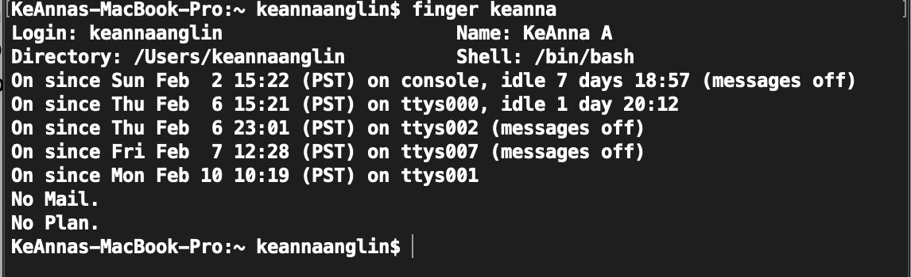
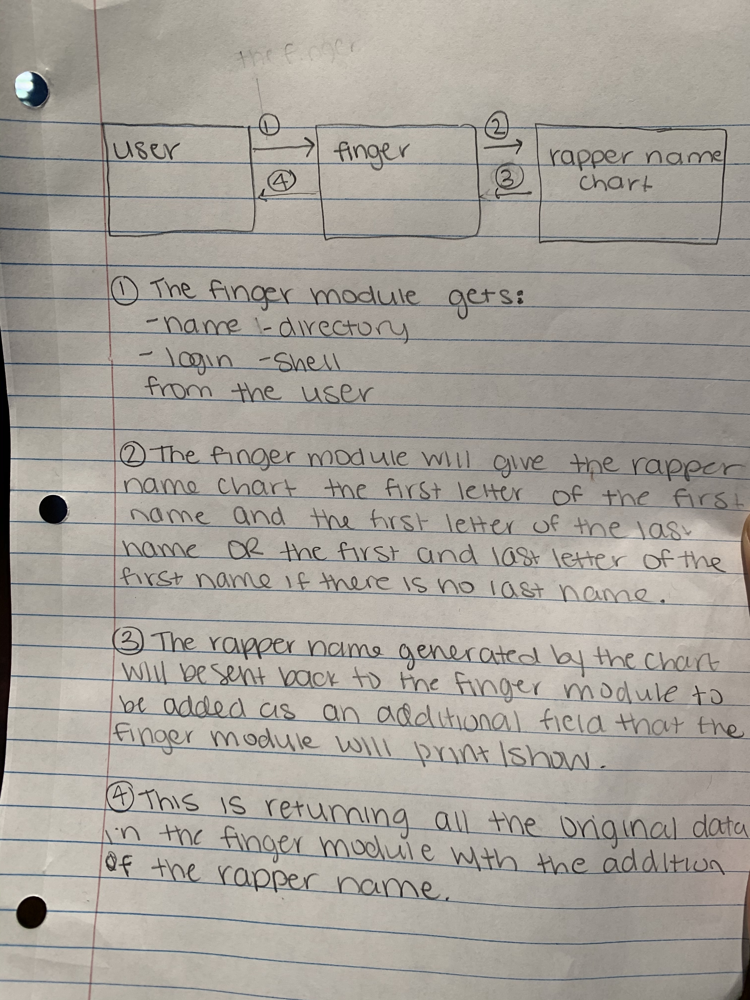

# Detailed Design Document
Authors: KeAnna Anglin, Lauren Lindsey, and Shanaya Nagendran

##  Detailed list of Linux modules that will be modified/affected
We will only be modifying the finger module. Since we plan to add to an existing module instead of creating a new one, our changes will only affect this module.

The module currently looks like:

And we plan to add another output line called "Rapper Name: " which will then give the user a rapper name. This is based off of the first letter of their first name and first letter of their last name (value taken from the "Name: " output line), or if there is no last name, the first letter of their first name and last letter of their first name. 

#### The mapping is going to look something as follows:
##### First letter of first name:
| Letter | Name | Letter | Name |
|---|---|---|---|
| A | Lil | N | Killa |
| B | Shawty | O | Brotha |
| C | Dirty | P | Drippin |
| D | Pusha | Q | Mo |
| E | Nephew | R | Grillz |
| F | Tasty | S | $hmoney |
| G | Drizzy | T | Fresh |
| H | Crispy | U | MC |
| I | Senor | V | Smoke |
| J | Scumbag | W | BB |
| K | Thug | X | Clout |
| L | Baby | Y | Chilly |
| M | Krakka | Z | Sir |

##### First letter of last name (or last letter of first name):
| Letter | Name | Letter | Name |
|---|---|---|---|
| A | Baby | N | Dagga |
| B | Glock | O | Pain |
| C | Dollaz | P | Swaggy |
| D | Tha Juice | Q | Flame |
| E | Dawg | R | Funk |
| F | Computer | S | Skrt Skrt |
| G | $moke | T | Dijon |
| H | Low Key | U | Kool |
| I | Double-O | V | Steez |
| J | Playa | W | Pastrami |
| K | Dutch Boy | X | Get 'Em |
| L | Book Nerd | Y | Lasagna |
| M | Juice Box | Z | Ca$h |

##### Examples:
- KeAnna Anglin -> Thug Baby
- Shanaya Nagendran -> $hmoney Dagga
- Lauren Lindsey -> Baby Book Nerd

## Detailed list of any new modules that you will produce 
As mentioned above, we plan to only modify the finger module by adding another output. We may need to add another function, or just add to an existing function with our ideal mapping from Name -> Rapper Name, as well as store variables for the letters we are using for this mapping. In this function, we will need to store our return value and print it out in similar fashion as the other outputted values. 

## Class diagram showing affected modules [and any new modules] and how they related to one another

## List or table of explanations of all command line options that will be implemented
There will be no new command line options. The current command is "finger [username]", which will provide us with the information we need to make our change to the module. We figured since the finger command is not that common, adding an additional piece of information wouldn't really inconvinence those that use this command, as it isn't printing out much additional info and can be disregarded if neccessary. 

