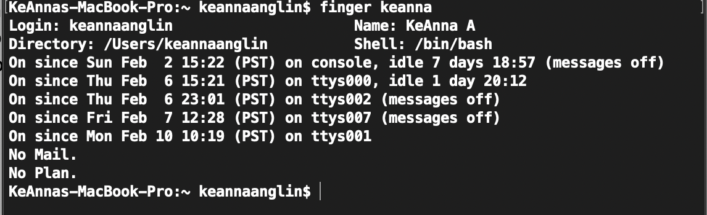

# Preliminary Design Document
Authors: KeAnna Anglin, Lauren Lindsey, and Shanaya Nagendran

### Description of Modification/Addition to Linux
For our semester project, we plan to modify the "finger" command to produce an additional ouput which will be the users "rapper name". This will be produced using the first letter of the user's first name and the first letter of the user's last name. Because we know that every user does not have a first and last name inputted on their machine, we will work around this by using the first letter of their first name and the last letter of their first name as a work around if need be.

For example, when KeAnna types "finger KeAnna" in her terminal, the output is: 

With our modification, the output would also include KeAnna's rapper name: "Thug Jesus" in addition to the existing data.

### Rationale 
We think this would be a comical addition for a command that often overlooked. We hope that with this new,fresh addition more users will be inspired to use this command! #spreadthelove

### Preliminary list of possible Linux modules that will be modified/affected
For now, we just plan on modifying the finger module.
### Preliminary list of any new modules that we will produce 
Not applicable.
